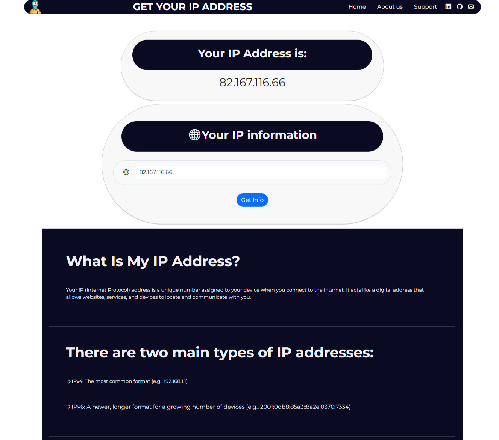
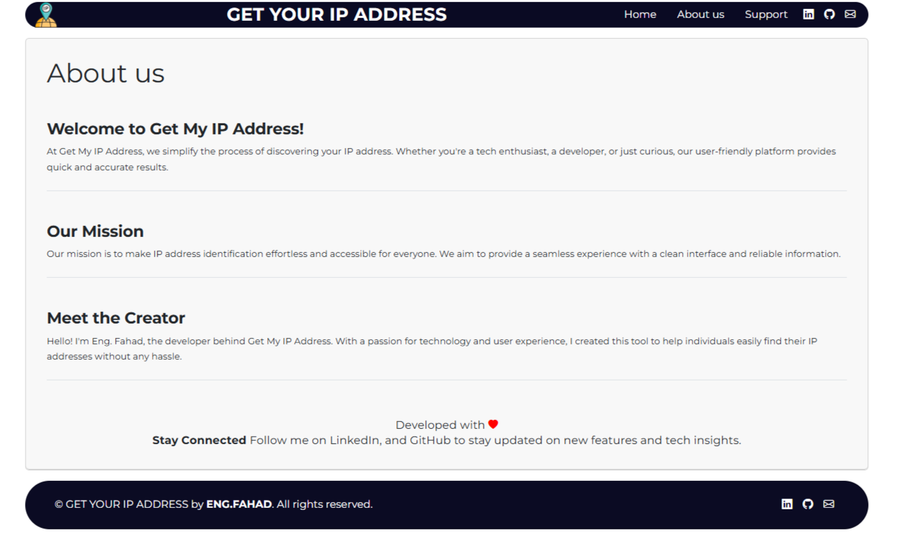
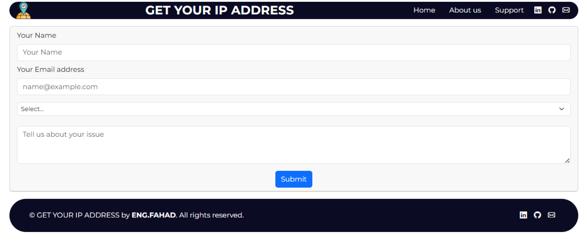

# 🌐 Get My IP Address

A simple and user-friendly website built with **React.js** to display your **IP address**, related **information** (like ISP, city, country), and your **location on a map**.

## 🔧 Features

- ✅ Real-time IP address detection  
- 📍 Displays ISP, city, country, and timezone  
- 🗺️ Map showing your exact location based on your IP  
- ⚡ Fast and responsive UI using React  

## 📷 Screenshots

  
  
  

## 🚀 Live Demo

https://getmyipadress.netlify.app/

## 🛠️ Built With

- [React.js](https://reactjs.org/) - JavaScript library for building user interfaces  
- [IP Geolocation API](https://ipapi.co/, https://ipify.org/) - For fetching IP and location data  
- [Mapbox](https://www.mapbox.com/) - For rendering interactive maps  
- [Axios](https://axios-http.com/) - For making HTTP requests

## 📫 Connect with Me

[](https://www.linkedin.com/in/fahad-alshwihani)  
[](https://github.com/FahadAlshwihani)


## 📁 Installation

Clone the repository:

```bash
git clone https://github.com/FahadAlshwihani/GET-MY-IP-ADRESS.git
cd GET-MY-IP-ADRESS